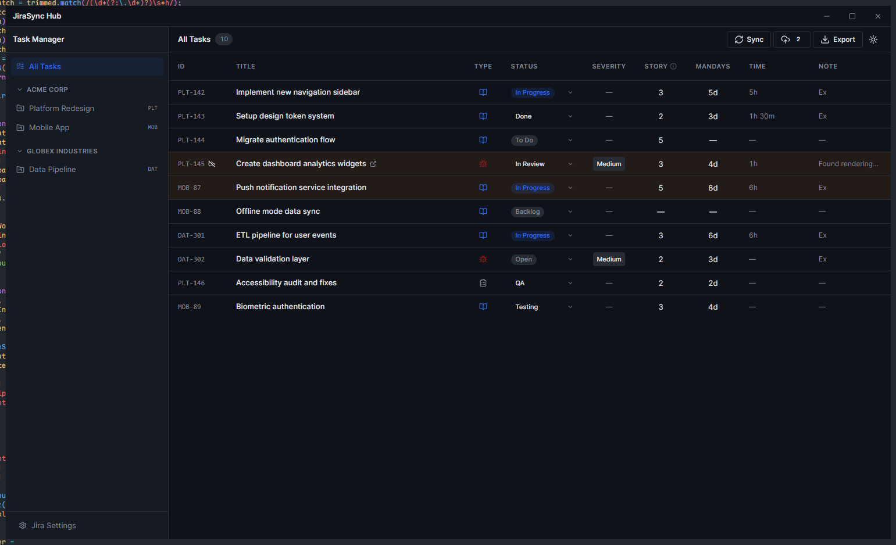

# JiraSync Hub

JiraSync Hub is a Tauri desktop app for syncing Jira tasks into a local workspace, editing them offline, logging work, and pushing only dirty changes back to Jira.



## Stack

- Tauri 2 for the desktop shell
- React 19 + Vite 7 for the frontend
- Tailwind CSS + shadcn/ui for the interface
- Zustand for app state
- Dexie / IndexedDB for local persistence

## Window Behavior

- **Windows / Linux:** custom HTML titlebar with Tauri window controls and resize handles
- **macOS:** native transparent titlebar with custom window background color created from Rust

## Jira Features

- Multiple Jira accounts stored locally
- Background sync with dirty-task protection
- Worklog creation and deletion
- CSV export
- Rich Jira description rendering via ADF-aware components

## Development

```bash
bun i
bun tauri dev
```

## macOS Build

```bash
# Build JiraSync Hub on macOS with Homebrew-installed Bun and Rust:
brew tap oven-sh/bun
brew install bun
brew install rust

# If the Xcode Command Line Tools are not installed yet, run:
xcode-select --install

# Install dependencies:
bun i

# Build the macOS application and installer:
bun tauri build
```

The macOS build artifacts are generated under:

```text
src-tauri/target/release/bundle/
```

With `"bundle.targets": "all"`, Tauri generates the native macOS bundle for the current OS target, including artifacts such as `.app` and `.dmg`.

Useful direct commands:

```bash
bun x vitest run
bun x eslint .
cargo check --manifest-path src-tauri/Cargo.toml
```

## Project Layout

```text
src/        React application
src-tauri/  Tauri app, capabilities, and Rust window setup
docs/       Screenshots and docs assets
public/     Static files
```
