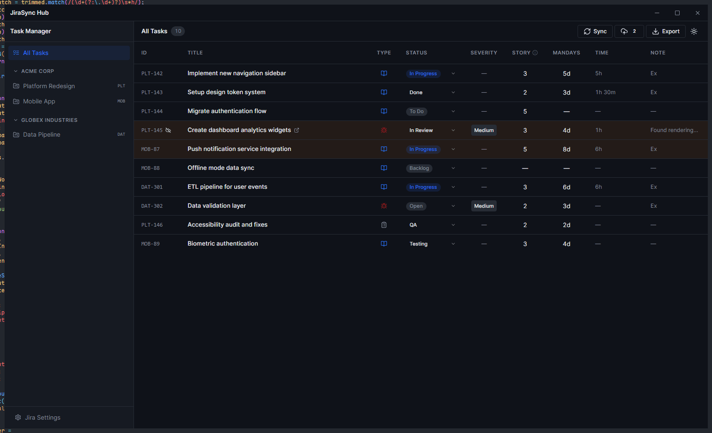
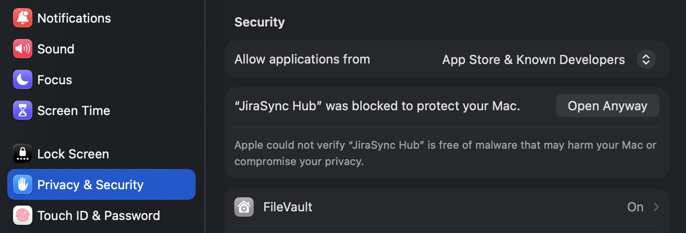

# JiraSync Hub

JiraSync Hub คือแอป desktop สำหรับดึง Jira tasks มาไว้ทำงานในเครื่อง, แก้ไขข้อมูลแบบ local-first, จัดการ worklog, แล้วค่อย sync กลับไป Jira เฉพาะรายการที่มีการเปลี่ยนแปลง

รองรับ `Windows`, `macOS`, และ `Linux` เท่านั้น



## ดาวน์โหลดและติดตั้ง

ดาวน์โหลดแพ็กเกจล่าสุดได้จาก [GitHub Releases](https://github.com/dvgamerr-app/jirasync-hub-app/releases)

- `Windows`: ใช้ไฟล์ `.exe` หรือ `.msi`
- `macOS`: ใช้ไฟล์ `.dmg`
- `Linux`: ใช้ไฟล์ `.AppImage` หรือ `.deb`

### Windows

1. ดาวน์โหลดไฟล์ติดตั้งจากหน้า Releases
2. เปิดไฟล์ `.exe` หรือ `.msi`
3. ติดตั้งตามขั้นตอนของตัวติดตั้ง

ถ้าต้องการเปิดแอปโดยไม่ติดตั้ง ให้ดาวน์โหลด `JiraSync Hub_<version>_windows_x64.exe`
แล้วเปิดไฟล์ได้โดยตรง (เครื่องต้องมี Microsoft Edge WebView2 Runtime)

### macOS

1. ดาวน์โหลดไฟล์ `.dmg` จากหน้า Releases
2. เปิดไฟล์แล้วลาก `JiraSync Hub.app` ไปที่ `Applications`
3. เปิดแอปจาก `Applications`

ถ้า macOS แจ้งว่าไม่สามารถเปิดแอปได้เพราะเป็นแอปที่ดาวน์โหลดมาจากอินเทอร์เน็ต:

1. ไปที่ `System Settings > Privacy & Security`
2. เลื่อนลงมาส่วน Security
3. กด `Open Anyway` สำหรับ JiraSync Hub



### Linux

- ถ้าใช้ `.AppImage`: ให้สิทธิ์รันไฟล์ก่อน แล้วเปิดใช้งาน
- ถ้าใช้ `.deb`: ติดตั้งผ่าน package manager ของ distro

### อัปเดตแอป

- แอปจะตรวจ GitHub Releases อัตโนมัติเมื่อเปิดใช้งาน และแจ้งเวอร์ชันใหม่ที่มุมขวาล่าง
- กด `Update now` เพื่อดาวน์โหลดและติดตั้ง จากนั้นกด `Restart now` เพื่อเปิดเวอร์ชันใหม่
- บน Windows ระบบจะดาวน์โหลดก่อน แล้วแสดง `Restart to update` เพราะตัว installer ต้องปิดแอประหว่างติดตั้ง
- เปิดหรือปิดการตรวจอัปเดตอัตโนมัติ และสั่ง `Check for Updates` เองได้ที่ `Settings`

## สิ่งที่ต้องเตรียมก่อนใช้งาน

- Jira Cloud instance เช่น `https://your-company.atlassian.net`
- Email ของ Atlassian account
- Jira API token
  - สร้างได้ที่ <https://id.atlassian.net/manage-profile/security/api-tokens>
- อินเทอร์เน็ตตอนดึงข้อมูลจาก Jira หรือ sync กลับไป Jira

## การใช้งานพื้นฐาน

### 1. เพิ่ม Jira instance

1. เปิดแอป แล้วกด `Settings`
2. กด `Add Account`
3. กรอกข้อมูลต่อไปนี้
   - `Display Name` ถ้าต้องการตั้งชื่อให้อ่านง่าย
   - `Jira Instance URL` ใส่ได้ทั้ง subdomain เช่น `acme` หรือ URL เต็มเช่น `https://acme.atlassian.net` (รองรับเฉพาะ Atlassian Cloud `*.atlassian.net` ด้วย https)
   - `Email`
   - `API Token`
4. กด `Test` เพื่อตรวจสอบการเชื่อมต่อ
5. กด `Save & Connect`

หมายเหตุ:

- ข้อมูล credentials ถูกเก็บไว้ในเครื่องเท่านั้น: API token เก็บใน Windows Credential Manager / macOS Keychain (Linux ยังเก็บแบบเข้ารหัสในแอป)
- สามารถเพิ่มได้มากกว่า 1 Jira account

### 2. ดึงข้อมูลครั้งแรกจาก Jira

1. หลังเชื่อมต่อสำเร็จ ให้กดปุ่ม `Sync`
2. แอปจะดึง projects, tasks, statuses และ worklogs ที่เกี่ยวข้องมาเก็บในเครื่อง
3. หลังจากมีข้อมูลแล้ว รายการโปรเจกต์จะปรากฏที่ sidebar

`Sync` ปุ่มนี้คือการดึงข้อมูลจาก Jira ลงมาในเครื่อง ไม่ใช่การส่งข้อมูลกลับขึ้น Jira

### 3. เลือก Story Point field ของแต่ละโปรเจกต์

Story point field ของ Jira แต่ละโปรเจกต์อาจไม่ใช้ custom field เดียวกัน จึงต้องตั้งค่าแยกต่อโปรเจกต์

1. ไปที่ `Settings`
2. กด `Story Point Fields`
3. เลือก field ของแต่ละโปรเจกต์
4. กด `Save`

หมายเหตุ:

- ถ้ายังไม่เห็นโปรเจกต์ในหน้านี้ ให้กด `Sync` อย่างน้อย 1 ครั้งก่อน
- ระบบจะพยายาม auto-detect field ที่น่าจะเป็น story point ให้ก่อน ถ้าตรวจเจอ
- ถ้า Jira ของบางโปรเจกต์ใช้ field คนละตัว สามารถเลือกคนละค่าได้ตามโปรเจกต์

### 4. แก้ไขข้อมูล Jira ในแอป

เมื่อเลือก task แล้ว สามารถแก้ข้อมูลหลักได้จากแถบรายละเอียดด้านขวา

- `Type`
- `Severity`
- `Status`
- `Story Level`
- `Mandays`
- `Note` (เก็บในเครื่องเท่านั้น ไม่ส่งขึ้น Jira; กด "Post as Jira comment" ถ้าต้องการส่งเป็น comment)
- `Worklogs`

ข้อสำคัญ:

- การแก้ไขจะถูกบันทึกลงในเครื่องก่อน และ task จะถูก mark เป็น `dirty`
- ยังไม่ถูกส่งกลับ Jira ทันที จนกว่าจะกด sync กลับ
- `Story Level` ตั้งได้เฉพาะ task ที่มี `Type = Story`
- `1 manday = 8 ชั่วโมง`

การ map กลับไป Jira:

- `Story Level` -> Jira story point field ที่เลือกไว้ของโปรเจกต์นั้น
- `Severity` -> Jira priority
- `Mandays` -> Jira original estimate / timetracking
- `Type` -> Jira issue type
- `Status` -> Jira transition (ถ้าเปลี่ยนสถานะไม่ได้ตาม workflow จะแจ้งสาเหตุ และ task ยังค้างเป็น dirty)
- `Worklogs` ที่เพิ่มหรือลบ -> Jira worklog

แอปจะส่ง **เฉพาะ field ที่คุณแก้จริง** เท่านั้น เช่น ถ้าแก้แค่ log เวลา จะไม่มีการแตะ priority, story point หรือ description ของ ticket

เกร็ดการกรอก:

- ช่อง `Mandays` พิมพ์ตัวเลขเปล่าได้ (`2` = 2 วัน) หรือ `1d 4h 30m` — มีบรรทัด preview บอกว่าตีความเป็นเท่าไร
- ช่อง `Log Time` ตัวเลขเปล่า = ชั่วโมง (`30` = 30 ชั่วโมง, ใช้ `30m` สำหรับนาที) และจะเตือนถ้าเกิน 24 ชั่วโมง
- worklog ของเพื่อนร่วมทีมบน ticket เดียวกันจะแสดงเป็นอ่านอย่างเดียว และไม่ถูกนับในเวลา, Export หรือ Speed rate ของคุณ
- ปุ่ม `Discard` ใน task ที่ยังไม่ได้ push จะคืนค่าจาก Jira (รวมทิ้ง worklog ที่ยังไม่ push); ปุ่ม `Discard all` ด้านบนทำกับทุก task

ถ้า task เดิมมี Jira description อยู่แล้ว และระบบดึงมาได้ จะสามารถเปิดดูได้จากปุ่ม `Show Description`

### 5. Sync กลับไป Jira

หลังแก้ไขข้อมูลแล้ว มี 2 วิธีในการส่งกลับ Jira

1. กดปุ่ม `Sync` ใน task นั้น เพื่อส่งเฉพาะรายการเดียว
2. กดปุ่ม upload/cloud ด้านบน เพื่อส่งทุก task ที่เป็น dirty

เมื่อ sync สำเร็จ:

- task จะถูก mark ว่า sync แล้ว
- worklog ที่ pending create/delete จะถูกอัปเดตตาม Jira

แยกให้ง่าย:

- `Sync` ด้านบน = ดึงข้อมูลล่าสุดจาก Jira ลงมา
- `Upload/Cloud` = ส่ง dirty changes จากเครื่องกลับขึ้น Jira

### 6. Export ข้อมูล

1. กด `Export`
2. เลือกเดือนที่ต้องการ export
3. กด `Copy CSV` เพื่อคัดลอก หรือ `Save CSV` เพื่อบันทึกไฟล์

ข้อมูล export จะอิงจาก worklogs **ของคุณเอง** ในเดือนที่เลือก (รวม ticket ที่คุณสร้างแต่ assign ให้คนอื่น ถ้าคุณ log เวลาไว้) ไฟล์ที่ Save เป็น UTF-8 พร้อม BOM เพื่อให้ Excel อ่านภาษาไทยได้ถูกต้อง และมีคำเตือนถ้ามี worklog ที่ยังไม่ได้ push ขึ้น Jira ออกเป็น CSV สำหรับใช้งานต่อได้ทันที โดยมีข้อมูลหลักเช่น

- Full name
- Project
- Month / Year
- Type
- Story Point
- Severity
- Usage Time (min)
- Ref URL
- Note

## พฤติกรรมการ sync โดยรวม

- แอปจะทำ background pull sync เป็นระยะเมื่อมี Jira account ถูกตั้งค่าไว้
- การแก้ไขในเครื่องจะไม่ทับ Jira ทันที
- แอปจะ push เฉพาะ task ที่มีการเปลี่ยนแปลงจริง

## Architecture และ performance

- IndexedDB เป็นแหล่งข้อมูลหลักของแอป และโหลดข้อมูลแยกตาม Jira account ผ่าน Dexie indexes เพื่อลดการอ่าน record ที่ไม่เกี่ยวข้อง
- หน้า task คำนวณ filter/sort เพียงครั้งเดียวต่อ state change แล้วส่งผลลัพธ์เดียวกันให้ตารางและ task counter
- การ push task รายการเดียวจะ reconcile เฉพาะ task และ worklogs ของรายการนั้นใน Zustand store โดยไม่ reload ฐานข้อมูลทั้งหมด
- Error Boundary ครอบส่วนหลักของแอป เพื่อแสดงหน้ากู้คืนแทนจอว่างเมื่อเกิด runtime error ที่ไม่คาดคิด

## พัฒนาต่อจาก source

```bash
bun install
bun tauri dev
```

คำสั่งที่ใช้บ่อย:

```bash
bun lint
bun format
bun test
bun run test:e2e
bun run build
bun run cg:check
bun audit
```

`bun run test:e2e` รัน Playwright กับ UI จริงโดยใช้ Jira จำลอง (ไม่ต้องมี Tauri หรือบัญชี Jira) ครั้งแรกต้องติดตั้ง browser ด้วย `bun x playwright install chromium`

## Build แอป

```bash
bun tauri build
```

ไฟล์ build จะถูกสร้างไว้ใต้:

```text
src-tauri/target/release/bundle/
```

แพ็กเกจที่ได้ขึ้นกับ OS ที่ build:

- `macOS`: `.app`, `.dmg`
- `Windows`: NSIS installer, `.msi`
- `Linux`: `.AppImage`, `.deb`

### Updater signing สำหรับผู้ดูแล release

Tauri บังคับให้ updater artifacts มีลายเซ็นทุกครั้ง โดย workflow ใช้ GitHub Actions Secret
ชื่อ `TAURI_SIGNING_PRIVATE_KEY` และ commit เฉพาะ public key ใน `src-tauri/tauri.conf.json`

- private key หลักของโปรเจกต์เก็บนอก repository ที่ `%USERPROFILE%\.tauri\jirasync-hub.key`
- ต้อง backup private key นี้ในที่ปลอดภัย ห้าม commit หรือแชร์
- ห้าม generate key ใหม่สำหรับ release ถัดไป เพราะแอปที่ติดตั้งอยู่จะไม่ยอมรับลายเซ็นจาก key ใหม่
- การ push tag `v*` จะ build signed updater artifacts, `.sig` และ `latest.json` ไปยัง GitHub Release
- Windows จะมีไฟล์ `.exe` สำหรับเปิดโดยตรงเพิ่มด้วย โดย build แยกด้วย `--no-bundle`
- local signed build ใช้ `TAURI_SIGNING_PRIVATE_KEY` ชี้ไปยัง private key ก่อนรัน `bun tauri build`
